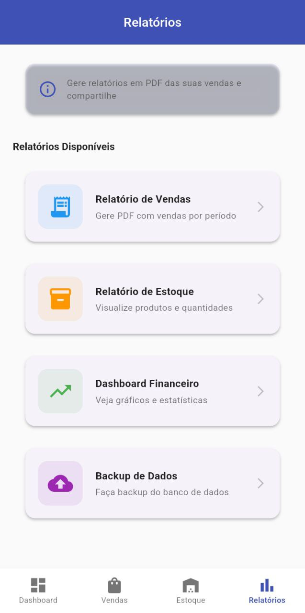
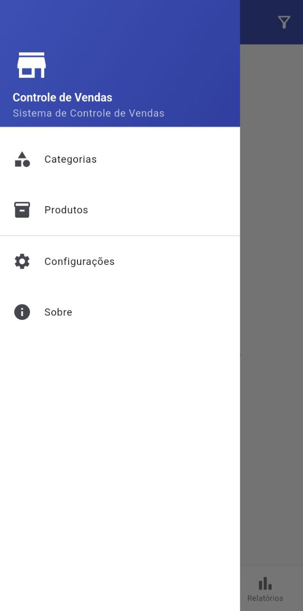
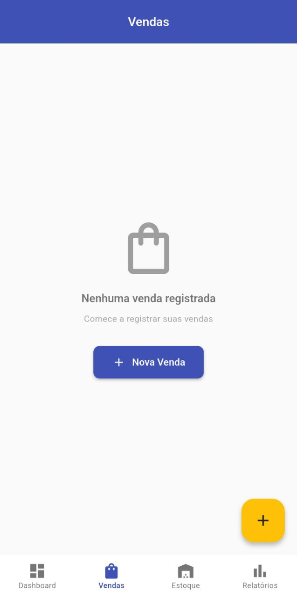

# 📊 Controle de Vendas

<div align="center">

**Sistema completo de controle de vendas para pequenos negócios**

[](https://flutter.dev)
[](https://dart.dev)
[](LICENSE)

</div>

---

## 📱 Sobre o Aplicativo

**Controle de Vendas** é um sistema mobile completo desenvolvido em Flutter para gerenciamento de vendas, estoque e finanças de pequenos negócios. O aplicativo oferece uma solução offline-first com banco de dados local SQLite, permitindo operação sem necessidade de internet.

### ✨ Principais Funcionalidades

- **📦 Gestão de Produtos e Variações**
  - Cadastro de produtos com múltiplas variações (sabores, tamanhos, tipos)
  - Exemplo: Produto "Chop" com variações "Chop de Morango", "Chop de Vinho", etc.
  - Controle de preço unitário e custo por variação
  - Organização por categorias personalizadas

- **📊 Controle de Estoque Inteligente**
  - Registro de entrada, saída e ajustes de estoque
  - Alertas automáticos de estoque baixo e zerado
  - Histórico completo de movimentações
  - Baixa automática de estoque ao finalizar vendas

- **💰 Sistema de Vendas Completo**
  - Carrinho de compras intuitivo
  - Cálculo automático de lucro por venda
  - Múltiplas formas de pagamento (Dinheiro, PIX, Débito, Crédito)
  - Geração de recibos em PDF

- **📈 Dashboard e Relatórios**
  - Métricas em tempo real (vendas do dia, lucro, ticket médio)
  - Gráficos de vendas dos últimos 7 dias
  - Ranking de produtos mais vendidos
  - Análise de margem de lucro
  - Estatísticas por forma de pagamento

- **🔄 Backup e Restauração**
  - Exportação completa do banco de dados
  - Importação de backups anteriores
  - Compartilhamento de backups via WhatsApp, email, etc.

- **📄 Geração de PDFs**
  - Recibos de vendas profissionais
  - Relatórios de vendas por período
  - Compartilhamento direto via apps

---

## 🖼️ Screenshots

<div align="center">

### Dashboard


### Gestão de Produtos


### Vendas


### Relatórios


</div>

---

## 🛠️ Tecnologias Utilizadas

### Stack Principal
- **Framework**: Flutter 3.10+
- **Linguagem**: Dart 3.0+
- **Banco de Dados**: SQLite (sqflite + sqflite_common_ffi)
- **Gerenciamento de Estado**: Provider

### Bibliotecas Principais
| Biblioteca | Versão | Finalidade |
|-----------|--------|------------|
| `provider` | ^6.1.2 | Gerenciamento de estado |
| `sqflite` | ^2.3.3 | Banco de dados (mobile) |
| `sqflite_common_ffi` | ^2.3.3 | Banco de dados (desktop) |
| `fl_chart` | ^0.68.0 | Gráficos e visualizações |
| `pdf` | ^3.11.1 | Geração de PDFs |
| `printing` | ^5.13.2 | Impressão e compartilhamento |
| `share_plus` | ^9.0.0 | Compartilhamento de arquivos |
| `intl` | ^0.19.0 | Formatação (pt_BR) |
| `path_provider` | ^2.1.3 | Acesso a diretórios do sistema |
| `file_picker` | ^8.0.6 | Seleção de arquivos |
| `permission_handler` | ^11.3.1 | Gerenciamento de permissões |

---

## 📋 Pré-requisitos

- **Flutter SDK**: 3.10 ou superior
- **Dart SDK**: 3.0 ou superior
- **Android Studio** / **VS Code** com extensões Flutter
- **Dispositivo Android** (API 21+) ou **Emulador**
- **Linux/Windows/macOS** para desenvolvimento desktop (opcional)

---

## 🚀 Instalação e Configuração

### 1. Clone o repositório

```bash
git clone https://github.com/DevWander/controle_vendas.git
cd controle_vendas
```

### 2. Instale as dependências

```bash
flutter pub get
```

### 3. Execute o aplicativo

#### Mobile (Android/iOS)
```bash
# Debug mode
flutter run

# Release mode
flutter run --release
```

#### Desktop (Linux/Windows/macOS)
```bash
# Linux
flutter run -d linux

# Windows
flutter run -d windows

# macOS
flutter run -d macos
```

### 4. Gerar APK para distribuição

```bash
# APK de release
flutter build apk --release

# APK otimizado por arquitetura
flutter build apk --split-per-abi
```

O APK estará em: `build/app/outputs/flutter-apk/app-release.apk`

---

## 📖 Como Usar

### 1️⃣ Configuração Inicial

#### Criar Categorias
1. Abra o **menu lateral** (ícone ☰)
2. Acesse **Categorias**
3. Toque no botão **+** (canto inferior direito)
4. Preencha: Nome, Descrição, Ícone e Cor
5. Salve

**Exemplo**: Categoria "Bebidas" com ícone de copo e cor azul

#### Cadastrar Produtos com Variações
1. Abra o **menu lateral**
2. Acesse **Produtos**
3. Toque no botão **+**
4. Preencha os dados do produto:
   - **Nome**: Ex: "Chop"
   - **Descrição**: "Chop gelado de várias frutas"
   - **Categoria**: Selecione "Bebidas"

5. **Adicione Variações** (sabores/tamanhos):
   - Toque em **"Adicionar Variação"**
   - **Nome/Sabor**: Ex: "Chop de Morango"
   - **Preço de Venda**: R$ 1,00 (por unidade)
   - **Quantidade em Estoque**: 200 (unidades totais)
   - **Estoque Mínimo**: 20 (alerta quando atingir)
   - Salve a variação

6. Repita para outras variações (Chop de Vinho, Chop de Uva, etc.)
7. Salve o produto

> **💡 Dica**: Você pode registrar todo o estoque de uma vez. Por exemplo, se você fez 200 chops de morango que custaram R$ 30,00 no total, registre 200 unidades no estoque e o sistema calculará automaticamente o custo unitário (R$ 0,15 cada).

### 2️⃣ Gestão de Estoque

#### Adicionar Estoque
1. Acesse a aba **Estoque**
2. Selecione o produto/variação
3. Toque em **"Adicionar Estoque"**
4. Informe a quantidade e observação
5. Confirme

#### Visualizar Movimentações
- Acesse **Estoque** → **Histórico**
- Veja todas as entradas, saídas e ajustes
- Filtre por produto ou período

### 3️⃣ Realizar Vendas

1. Acesse a aba **Vendas**
2. Toque no botão **+** (Nova Venda)
3. **Adicione produtos ao carrinho**:
   - Busque o produto
   - Selecione a variação (sabor/tamanho)
   - Informe a quantidade
   - Toque em "Adicionar ao Carrinho"

4. **Finalize a venda**:
   - Confira o resumo (subtotal, total)
   - Selecione a **forma de pagamento** (Dinheiro, PIX, Débito, Crédito)
   - Adicione observações (opcional)
   - Toque em **"Finalizar Venda"**

5. O sistema automaticamente:
   - Calcula o lucro da venda
   - Baixa o estoque dos produtos vendidos
   - Registra as movimentações
   - Atualiza o dashboard

#### Gerar PDF da Venda
1. Na lista de vendas, toque na venda desejada
2. Na tela de detalhes, toque no ícone **PDF**
3. Compartilhe o recibo via WhatsApp, email, etc.

### 4️⃣ Dashboard e Análises

Acesse a aba **Dashboard** para visualizar:

- **Vendas do Dia**: Valor total e quantidade de vendas hoje
- **Lucro do Dia**: Lucro calculado automaticamente
- **Total Geral**: Todas as vendas e lucro total
- **Ticket Médio**: Valor médio por venda
- **Alertas de Estoque**: Produtos zerados ou com estoque baixo
- **Gráfico de Vendas**: Evolução dos últimos 7 dias
- **Produtos Mais Vendidos**: Ranking com lucro por produto

### 5️⃣ Relatórios

Acesse a aba **Relatórios** para:

- **Relatório de Vendas**: Gere PDFs de vendas por período
- **Relatório de Estoque**: Visualize situação atual do estoque
- **Dashboard Financeiro**: Análises detalhadas
- **Backup de Dados**: Exporte e importe backups

### 6️⃣ Backup e Restauração

#### Criar Backup
1. Abra **Menu Lateral** → **Configurações**
2. Seção **Backup e Restauração**
3. Toque em **"Criar Backup"**
4. Compartilhe o arquivo `.db` gerado

#### Restaurar Backup
1. Em **Configurações** → **Backup e Restauração**
2. Toque em **"Restaurar Backup"**
3. Selecione o arquivo `.db` anteriormente salvo
4. Confirme a restauração
5. O app reiniciará com os dados restaurados

> **⚠️ Atenção**: A restauração substitui **todos** os dados atuais pelos dados do backup.

---

## 🗄️ Estrutura do Banco de Dados

### Diagrama de Relacionamentos

```
categorias (1) ──────< (N) produtos
                               │
                               └──< (N) variacoes ──┬──< (N) itens_venda
                                          │          │
                                          │          └──> (1) vendas
                                          │
                                          └──< (N) movimentacoes_estoque
```

### Tabelas Principais

#### `categorias`
| Campo | Tipo | Descrição |
|-------|------|-----------|
| id | INTEGER | Chave primária |
| nome | TEXT | Nome da categoria |
| descricao | TEXT | Descrição (opcional) |
| icone | TEXT | Nome do ícone Material |
| cor | TEXT | Código de cor hex |
| data_criacao | TEXT | ISO 8601 timestamp |

#### `produtos`
| Campo | Tipo | Descrição |
|-------|------|-----------|
| id | INTEGER | Chave primária |
| nome | TEXT | Nome do produto |
| descricao | TEXT | Descrição (opcional) |
| categoria_id | INTEGER | FK → categorias.id |
| custo_total | REAL | Custo total de produção |
| data_criacao | TEXT | ISO 8601 timestamp |
| ativo | INTEGER | 1 = ativo, 0 = inativo |

#### `variacoes`
| Campo | Tipo | Descrição |
|-------|------|-----------|
| id | INTEGER | Chave primária |
| produto_id | INTEGER | FK → produtos.id |
| nome | TEXT | Nome da variação (sabor/tamanho) |
| preco_venda | REAL | Preço unitário de venda |
| quantidade_estoque | INTEGER | Quantidade atual |
| estoque_minimo | INTEGER | Alerta de estoque baixo |
| data_criacao | TEXT | ISO 8601 timestamp |
| ativo | INTEGER | 1 = ativo, 0 = inativo |

#### `vendas`
| Campo | Tipo | Descrição |
|-------|------|-----------|
| id | INTEGER | Chave primária |
| data_venda | TEXT | ISO 8601 timestamp |
| valor_total | REAL | Valor total da venda |
| custo_total | REAL | Custo total dos produtos |
| lucro | REAL | Lucro (valor_total - custo_total) |
| forma_pagamento | TEXT | DINHEIRO/PIX/DEBITO/CREDITO |
| observacoes | TEXT | Observações (opcional) |

#### `itens_venda`
| Campo | Tipo | Descrição |
|-------|------|-----------|
| id | INTEGER | Chave primária |
| venda_id | INTEGER | FK → vendas.id |
| variacao_id | INTEGER | FK → variacoes.id (RESTRICT) |
| quantidade | INTEGER | Quantidade vendida |
| preco_unitario | REAL | Preço no momento da venda |
| subtotal | REAL | quantidade × preco_unitario |
| custo_unitario | REAL | Custo no momento da venda |

#### `movimentacoes_estoque`
| Campo | Tipo | Descrição |
|-------|------|-----------|
| id | INTEGER | Chave primária |
| variacao_id | INTEGER | FK → variacoes.id |
| tipo | TEXT | ENTRADA/SAIDA/AJUSTE |
| quantidade | INTEGER | Quantidade movimentada |
| quantidade_anterior | INTEGER | Estoque antes |
| quantidade_posterior | INTEGER | Estoque depois |
| data_movimentacao | TEXT | ISO 8601 timestamp |
| observacao | TEXT | Motivo da movimentação |
| venda_id | INTEGER | FK → vendas.id (se for saída por venda) |

### Índices para Performance
- `idx_produtos_categoria` em `produtos.categoria_id`
- `idx_variacoes_produto` em `variacoes.produto_id`
- `idx_vendas_data` em `vendas.data_venda`
- `idx_itens_venda` em `itens_venda.venda_id`
- `idx_itens_variacao` em `itens_venda.variacao_id`
- `idx_movimentacoes_variacao` em `movimentacoes_estoque.variacao_id`

---

## 📁 Estrutura do Projeto

```
lib/
├── main.dart                          # Entry point + Provider setup
├── app.dart                           # MaterialApp + rotas + tema
├── core/
│   ├── constants/
│   │   ├── app_colors.dart           # Paleta de cores
│   │   ├── app_strings.dart          # Textos do app
│   │   └── app_routes.dart           # Rotas nomeadas
│   ├── themes/
│   │   └── app_theme.dart            # Tema Material 3
│   └── utils/
│       ├── currency_formatter.dart    # Formatação R$ (pt_BR)
│       ├── date_formatter.dart        # Formatação de datas
│       ├── validators.dart            # Validações de formulário
│       └── message_helper.dart        # Mensagens padronizadas
├── models/
│   ├── categoria.dart
│   ├── produto.dart
│   ├── variacao.dart
│   ├── venda.dart
│   ├── item_venda.dart
│   └── movimentacao_estoque.dart
├── services/
│   ├── database/
│   │   ├── database_helper.dart       # Singleton SQLite
│   │   ├── database_service.dart      # Fachada CRUD
│   │   └── tables/                    # Queries por tabela
│   ├── pdf/
│   │   └── pdf_service.dart           # Geração de PDFs
│   └── backup/
│       └── backup_service.dart        # Backup/restore
├── providers/
│   ├── categoria_provider.dart
│   ├── produto_provider.dart
│   ├── venda_provider.dart
│   ├── estoque_provider.dart
│   └── dashboard_provider.dart
├── screens/
│   ├── home/
│   │   ├── home_screen.dart           # Bottom navigation
│   │   └── widgets/
│   ├── categorias/
│   ├── produtos/
│   ├── vendas/
│   ├── estoque/
│   ├── relatorios/
│   └── configuracoes/
└── widgets/                           # Componentes reutilizáveis
    ├── custom_button.dart
    ├── custom_text_field.dart
    ├── currency_text_field.dart
    ├── quantity_text_field.dart
    └── ...
```

---

## 🧮 Cálculo de Lucro

O sistema calcula lucro automaticamente em dois níveis:

### Por Item de Venda
```dart
custoUnitario = produto.custoTotal / totalVariacoes
lucroItem = (precoVenda - custoUnitario) × quantidade
```

### Por Venda Completa
```dart
valorTotal = soma de todos os subtotais
custoTotal = soma de todos os (custoUnitario × quantidade)
lucro = valorTotal - custoTotal
margemLucro = (lucro / valorTotal) × 100
```

**Exemplo Prático**:
- Produto: Chop (custo total de produção: R$ 30,00)
- Variações: 3 sabores (Morango, Vinho, Uva)
- Custo unitário automático: R$ 30,00 ÷ 200 unidades = R$ 0,15/unidade
- Venda: 10 Chops de Morango a R$ 1,00
- Lucro: (R$ 1,00 - R$ 0,15) × 10 = **R$ 8,50**

---

## 🔧 Build e Deploy

### Android APK

```bash
# APK universal
flutter build apk --release

# APKs separados por arquitetura (menor tamanho)
flutter build apk --split-per-abi

# App Bundle (para Google Play Store)
flutter build appbundle --release
```

### Linux Desktop

```bash
flutter build linux --release
```

### Instalação via USB (Desenvolvimento)

```bash
# Verificar dispositivos conectados
adb devices

# Instalar APK
adb install build/app/outputs/flutter-apk/app-release.apk

# Desinstalar versão anterior
adb uninstall com.example.controle_vendas
```

---

## 🐛 Troubleshooting

### Problema: "databaseFactory not initialized" no Linux/Windows

**Solução**: O projeto já inclui `sqflite_common_ffi` configurado no `main.dart` para suporte desktop.

### Problema: APK antigo sendo instalado

**Solução**:
```bash
flutter clean
rm -rf build/
cd android && ./gradlew clean && cd ..
flutter pub get
flutter build apk --release
adb uninstall com.example.controle_vendas
adb install build/app/outputs/flutter-apk/app-release.apk
```

### Problema: Erro ao deletar produto

**Causa**: Produto possui vendas registradas (constraint FOREIGN KEY)

**Solução**: Use a opção "Desativar" ao invés de "Excluir" para manter o histórico de vendas.

---

## 🤝 Contribuindo

Contribuições são bem-vindas! Para contribuir:

1. Fork o projeto
2. Crie uma branch para sua feature (`git checkout -b feature/MinhaFeature`)
3. Commit suas mudanças (`git commit -m 'Adiciona MinhaFeature'`)
4. Push para a branch (`git push origin feature/MinhaFeature`)
5. Abra um Pull Request

### Padrões de Código
- Siga o [Dart Style Guide](https://dart.dev/guides/language/effective-dart/style)
- Use `flutter analyze` antes de commitar
- Documente funções públicas com comentários ///
- Mantenha providers focados em responsabilidade única

---

## 📄 Licença

Este projeto está sob a licença MIT. Veja o arquivo [LICENSE](LICENSE) para mais detalhes.

---

## 👨‍💻 Desenvolvedor

**DevWander**
- GitHub: [@DevWander](https://github.com/DevWander)
- Email: devwanderlei@gmail.com

---

## 📞 Suporte

Encontrou um bug ou tem uma sugestão? Abra uma [issue](https://github.com/DevWander/controle_vendas/issues).

---

<div align="center">

**Desenvolvido com ❤️ usando Flutter**

</div>
